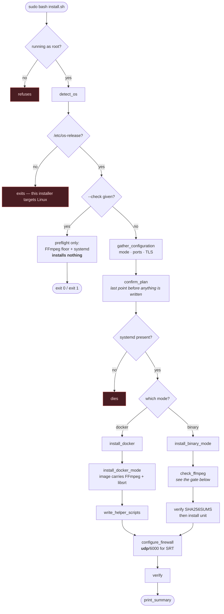
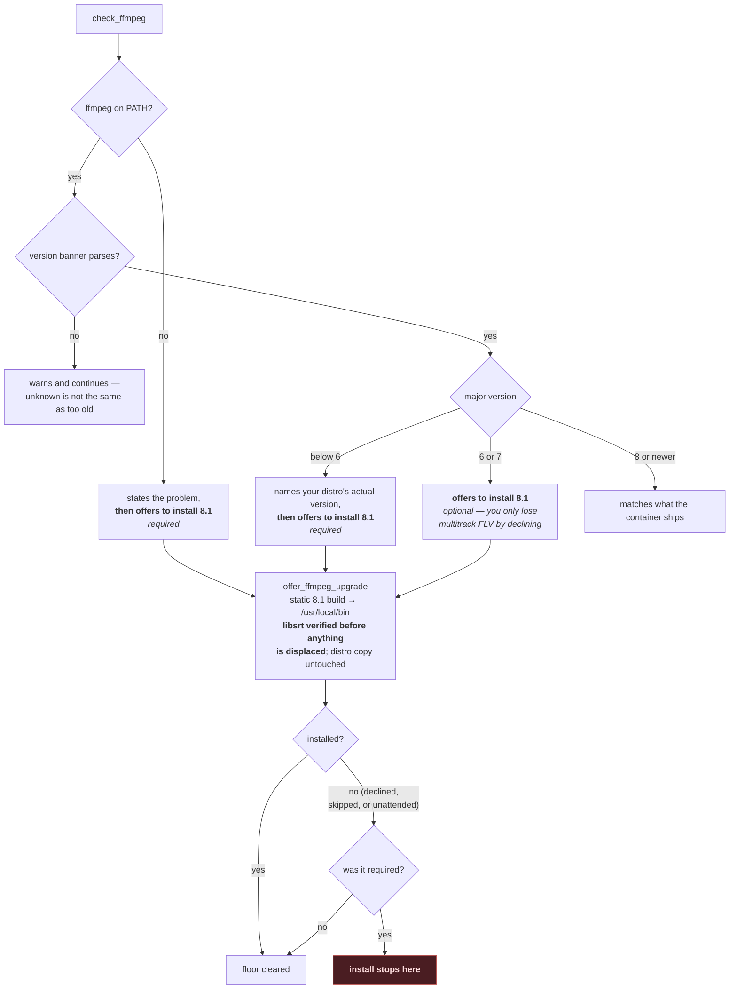

# Installing polyemesis

One binary, one dependency. The binary is self-contained — the React UI is
embedded, SQLite is pure Go, there is no cgo and no runtime library to install.
The dependency is **FFmpeg 6.0 or newer**, and it is where essentially every
installation problem comes from. Read the FFmpeg part of your platform's
section even if you skip the rest.

- [The scripted install](#the-scripted-install)
- ["I do not have a certificate"](#i-do-not-have-a-certificate--two-different-certificates)
- [Platform maturity](#platform-maturity)
- [The FFmpeg requirement](#the-ffmpeg-requirement)
- [Docker](#docker)
- [Linux (bare metal or VM)](#linux-bare-metal-or-vm)
- [macOS](#macos)
- [Windows](#windows)
- [Verifying the install](#verifying-the-install)
- [Ports](#ports)

---

## The scripted install

On Linux, `scripts/install.sh` does everything on this page interactively —
asks how you want it installed, checks the things that actually go wrong, and
rolls back cleanly if a step fails:

```bash
curl --proto '=https' --proto-redir '=https' --tlsv1.2 -fsSLO \
  https://raw.githubusercontent.com/rainmanjam/polyemesis/main/scripts/install.sh
less install.sh          # it runs as root; read it first
sudo bash install.sh
```

It offers two modes. **Docker** bundles a known-good FFmpeg with libsrt, so
nothing on the host matters. **Binary** installs the static binary plus a
systemd unit, and will not proceed against an FFmpeg below 6.0 — naming your
distribution's actual version when it recognises it — rather than installing a
service that cannot start. It offers to install a current FFmpeg for you at
that point; declining is what stops the install, not the old version itself.

### What it does, in order

Everything before `confirm_plan` only *reads* the host. Nothing is written
until you have seen the plan and agreed to it, and a failure after that point
runs the rollback trap rather than leaving a half-install behind.



The `--check` branch is what CI runs on every distro in the matrix: it
exercises detection, the architecture gate, the init gate and the FFmpeg floor,
and installs nothing.

### The FFmpeg gate

Only binary mode reaches this; in docker mode the image carries its own FFmpeg
and the host's version is irrelevant.



Two things about that gate are worth stating plainly, because they are the
parts people get caught by:

**Declining is only fatal when it was required.** At 6.x or 7.x you are simply
choosing to stay put, and everything except multitrack FLV behaves identically.
Below the floor — or with no FFmpeg at all — declining ends the install, because
polyemesis will not start against what you have.

**`--check` never installs anything, including with `--ffmpeg force`.** That
combination reads as two reasonable flags, and a preflight that replaced a
system binary would be a broken promise; it prints what *would* be installed
and exits. `--ffmpeg force` takes the upgrade without asking on a real run,
`--ffmpeg skip` declines it. Unattended runs never install FFmpeg on their own:
with no terminal to ask, the installer refuses and names the flag instead.

Nothing is deleted either way. The static build lands in `/usr/local/bin` ahead
of `/usr/bin` on a default `PATH`, your distribution's package is left where it
is, and the way back is `rm /usr/local/bin/ffmpeg /usr/local/bin/ffprobe`.

**And `PATH` order does not decide the outcome.** When the installer installs
FFmpeg itself, it writes the absolute path into the config it generates:

```yaml
ffmpeg:
  binary: "/usr/local/bin/ffmpeg"
  probe: "/usr/local/bin/ffprobe"
```

So polyemesis uses the build that was just verified even on a host whose `PATH`
puts `/usr/bin` first. Nothing is pinned when your *own* FFmpeg was accepted —
freezing a path to a distribution package would break your next `apt upgrade`
in a way nobody would connect back to this installer.

### The libsrt check, which is separate from the version

Clearing 6.0 and having SRT are two different questions, and an FFmpeg can pass
the first and fail the second — Homebrew's does, and so do several distribution
builds. That matters more than it sounds: RTMP carries **one stereo pair**, so
per-destination audio routing has nothing to route from, which is the main
reason to run polyemesis at all.

The installer offers the same static build here too, and that build is only
accepted if `ffmpeg -protocols` actually lists `srt`. You can still decline and
continue on RTMP — it works — but it is a choice made against an offer rather
than against a compile-it-yourself instruction.

### It asks the binary, not the version string

A version parsed out of `ffmpeg -version` is prose, and some builds do not
produce a parseable one — a git or nightly build announces itself as
`ffmpeg version N-119534-g...`, with no major number to compare.

Rather than guess, the installer runs a ~50 ms probe that exercises what
polyemesis actually depends on: the modern channel-layout API (the same `pan`
shape the audio router compiles) and `-progress` emitting the fields the engine
reads. A build whose version cannot be parsed but which passes the probe is
accepted on the measurement; one that fails it is refused and offered a
replacement, instead of being assumed fine.

### Verifying the download

In binary mode the release archive is checked against the release's published
`SHA256SUMS`. A **mismatch** is fatal. A **missing** sums file is also fatal —
those are the same risk with different evidence, and installing a binary nobody
can check, as root, is not a reasonable default. If you are deliberately
installing a release that has no published sums, `--allow-unverified` says so
explicitly.

What it gets right that a hand-rolled `docker run` usually does not: `/udp` on
the SRT port, `stop_grace_period: 30s` so a recording is finalised rather than
truncated, a firewall rule for **udp**/6000, and `CAP_NET_BIND_SERVICE` on the
unit when you choose ACME, without which the `:80` bind fails and issuance
never completes.

It never asks for an admin password. polyemesis has no account until you create
one on the first-run screen, so there is no credential for an installer to
handle. In binary mode it verifies the download against the release's published
`SHA256SUMS` and refuses to install on a mismatch.

**Linux only.** It is bash, systemd, apt and ufw/firewalld, and it exits
immediately anywhere else with `no /etc/os-release — this installer targets
Linux`. macOS installs from the [macOS](#macos) section below; Windows has its
own scripts in [`deploy/windows/`](../deploy/windows/).

The rest of this page is the manual version, and is worth reading if the script
fails or if you want to know what it did.

---

## "I do not have a certificate" — two different certificates

They come up together and neither is a blocker, so it is worth separating them.

### The TLS certificate: polyemesis makes its own

You do not need to obtain one. `tls.mode: selfsigned` generates a local CA and a
leaf at startup, so the connection is encrypted immediately and the only cost is
a browser warning until you install that CA — one command on each platform, in
[TLS.md](TLS.md#trusting-the-self-signed-ca). `acme` is the only mode that needs
a real certificate, and `auto` will not choose it without a public DNS name.

### The code-signing certificate: not needed to run

The released binaries are **not signed with a paid certificate** and macOS
binaries are **not notarized**. Neither stops them running.

**macOS.** This is the one that could have been a genuine problem: Apple Silicon
requires an arm64 binary to carry *a* signature to execute at all, and the
release cross-compiles darwin binaries on a Linux runner. Go's linker ad-hoc
signs `darwin/arm64` even when cross-compiling, which satisfies that
requirement. Verified by building in a Linux container with the release's own
flags and running the result on Apple Silicon:

```console
$ codesign -dv polyemesis-darwin-arm64
CodeDirectory v=20400 ... flags=0x20002(adhoc,linker-signed)
$ ./polyemesis-darwin-arm64 -version
polyemesis v0.2.0
```

What is *not* signed is a Developer ID, so the binary is not notarized.
`spctl -a -t execute` reports `rejected` — that answers "would Gatekeeper
approve this for distribution", not "will this run". Gatekeeper enforces on
files carrying `com.apple.quarantine`, which a browser download sets and `curl`
does not. If you hit it:

```bash
xattr -d com.apple.quarantine ./polyemesis
```

A freshly quarantined binary can also sit for a minute or two on its first run
while macOS scans it; the result is cached, and subsequent runs are immediate.

**Windows.** The `.exe` is unsigned, so SmartScreen shows a warning on first
run — *More info → Run anyway*, once. It does not prevent the service from
being registered or started.

**Docker avoids both**, on both platforms, and on macOS you probably want it
anyway: Homebrew's FFmpeg has no libsrt, and multitrack ingest needs it.

---

## Platform maturity

These are not four equal targets, and pretending otherwise would cost you a
weekend. But they are equal on one axis, and separating that from the rest is
the honest way to say it. Same framing as the
[README](../README.md#platform-maturity).

**The shared CI floor, identical on every push for all three operating
systems:** build, vet, the full Go test suite with FFmpeg installed, the binary
started and confirmed serving, and a three-track broadcast pushed through it
with per-band energy measured in each destination's output. Two destinations
take different track selections and the unselected tone must measure 25–40 dB
down, so a wrong mix fails rather than passing quietly.

Everything past that floor is where they diverge:

| Platform | Beyond the shared floor | Operationally |
|---|---|---|
| **Linux (server)** | The race detector, 11 acceptance suites and 3 container suites — none of which run on any other OS | **Primary.** Developed against, deployed, exercised |
| **Docker** | The 3 container suites run against this exact image | **Primary.** Built from this repo, bundling a pinned FFmpeg |
| **macOS** | Nothing further | **Daily driver.** Fine as a workstation and test rig. Homebrew's FFmpeg has no SRT — see below |
| **Windows** | Nothing further | **Unproven.** No live broadcast to a real platform, no exercise of the service wrapper or installer on a real host, and recording truncation on service stop is a known unresolved defect — see the note below |

**On the recording truncation.** This table filed it as Windows-only, and that
was wrong: it happened on Linux too, and had since the shared SRT listener was
introduced. `Manager.Stop` closed every established publisher *before* stopping
the engines, so the relay went quiet while the recorder's FFmpeg was still
blocked reading it — and an FFmpeg blocked in a read never reaches its SIGTERM
check. It missed the grace period, was killed, and the container's trailer was
never written. Measured on a live host: the file did not grow by one byte
across the stop, and `ffprobe` reported no duration on nearly two minutes of
footage.

That is fixed, and `scripts/acceptance-recording-stop.sh` holds it fixed. What
is **not** established is whether Windows was failing for the same reason. The
mechanism is not platform-specific, so it may well have been — but nobody has
run the suite there, so the row above still says what it says.

The distinction that matters for choosing: Windows is **tested, not operated**.
The broadcast path demonstrably works there and that job has already caught
Windows-only bugs — a `file://` URL corrupted by path separators, TLS keys left
world-readable because `os.FileMode` does nothing on Windows. What has never
happened is somebody running a real show on it.

If you are choosing where to run this, run it on Linux.

---

## The FFmpeg requirement

Two separate checks, and they fail differently:

**Version — 6.0 or newer, enforced.** polyemesis probes `ffmpeg -version` before
it opens the database and **refuses to start** on anything older, with a message
naming the binary and the version it found. The floor is 6.0 because multi-track
MPEG-TS mapping, the channel-layout API behind the audio mix matrix, and the
`-progress` fields the supervisor parses are only reliable from 6.x onwards.

**SRT — the reliable path to multitrack ingest, not enforced.** A build without
libsrt starts fine and warns. You can reach the UI and switch ingest to RTMP,
but *classic* RTMP carries a single stereo pair, so per-destination audio routing
has nothing to route from.

Enhanced RTMP is the exception, and it is a real one: it carries multiple audio
tracks and polyemesis ingests them. It is not an equal substitute, though —
that path is verified with FFmpeg 7.1+ as the publisher, does not work on 6.1.1,
and has **not** been confirmed with OBS publishing. Since OBS is what most
readers here are using, treat E-RTMP as a route worth trying rather than a
replacement for SRT.

Check both, on every platform:

```bash
ffmpeg -version | head -1
ffmpeg -protocols | tr ' ' '\n' | grep -x srt      # must print: srt
```

> Use the exact match. `ffmpeg -protocols | grep srt` is **misleading** —
> every build lists `srtp` (Secure RTP), a different protocol that happens to
> contain the substring.

### Which builds have libsrt

Checked 2026-07-26. **"Ran the check"** means the `-protocols` command above was
executed against that build. Everything else is read off a package index or a
published feature list — so run the check yourself rather than trusting the row.

| Source | libsrt |
|---|---|
| Docker image in this repo | yes — the build asserts it, and it was run |
| [BtbN](https://github.com/BtbN/FFmpeg-Builds/releases) static builds, **Linux** | yes — ran the check |
| Ubuntu 24.04 / Debian 13 `apt install ffmpeg` | advertised in the package build flags; not run |
| [BtbN](https://github.com/BtbN/FFmpeg-Builds/releases) static builds, **Windows** | same recipe as their Linux asset, but no Windows asset was downloaded or run |
| [gyan.dev](https://www.gyan.dev/ffmpeg/builds/) Windows builds | listed among the *essentials* build's externals; not downloaded or run |
| **Homebrew `ffmpeg` on macOS** | **no** — `srt` is not among the formula's dependencies, and the check was run |
| [johnvansickle.com](https://johnvansickle.com/ffmpeg/) static builds | not advertised; run the check before relying on it |

If your build has no SRT, polyemesis starts anyway and warns, so you can reach
Settings and switch the ingest to RTMP. But *classic* RTMP carries a single
stereo pair, so per-destination audio routing has nothing to route from.

Three ways out, in the order most people should try them: a build configured
with `--enable-libsrt`, one of the static builds above, or the Docker image —
which bundles one and asserts it at build time.

A fourth exists if your encoder speaks **Enhanced RTMP**, which does carry
multiple audio tracks: polyemesis ingests those and the routing works normally,
with no libsrt anywhere. The caveat is what keeps it fourth rather than first —
verified with FFmpeg 7.1+ publishing, broken on 6.1.1, and unconfirmed with OBS.
If your encoder is OBS, fix the FFmpeg build instead.

**Hardware encoders — nothing to install, nothing to configure.** Do *not* go
looking for a build with NVENC or VA-API compiled in on the strength of
`ffmpeg -encoders`: that list is what the binary was compiled with, not what
your machine can do, and a stock Ubuntu FFmpeg advertises all four vendors on a
box with no GPU. polyemesis test-encodes a frame with each one at startup and
offers only what worked. If you have a GPU you want it to reach — especially in
a container, where it has to be passed in explicitly — see
[docs/HARDWARE.md](HARDWARE.md).

---

## Docker

The least that can go wrong: the image bundles a pinned FFmpeg with SRT, so
nothing on the host matters except Docker itself.

**Prerequisites.** Docker Engine 20.10+ (or Docker Desktop). Nothing else — no
Go, no Node, no FFmpeg on the host.

**FFmpeg.** Pinned in the `Dockerfile` to a specific Alpine package version, not
floating. `apk add ffmpeg` would resolve to whatever the branch holds on the day
you build, which makes a rebuild months later a different product under the same
tag — and the thing that drifts is the transcoder, where a behaviour change
surfaces as a broken stream rather than a build error. The Dockerfile documents
how to bump it deliberately, and fails the build if the resulting FFmpeg has no
SRT.

**Install.**

```bash
git clone https://github.com/rainmanjam/polyemesis
cd polyemesis
docker compose up -d
docker compose logs -f
```

Open <http://localhost:8080> and set an admin password on the first-run screen.

**What the compose file publishes**, and why each one:

| Port | Why |
|---|---|
| `8080/tcp` | web UI and API |
| `6000/udp` | SRT ingest — **UDP**. Omitting `/udp` is the classic reason an SRT ingest silently receives nothing. |
| `1935/tcp` | RTMP ingest, the fallback for encoders that cannot do SRT |
| `80/tcp` | **ACME only**, and shipped commented out — see below |

Both ingest ports are published **once, for the whole install.** Adding a second
programme never means publishing another port or restarting the container: every
source arrives on the same listener and is told apart by its publish token (SRT)
or stream key (RTMP). That is the point of
[DESIGN-ONE-PORT-ONLY.md](DESIGN-ONE-PORT-ONLY.md) — editing
`docker-compose.yml` to add a source was a real cost it removed.

**Port 80 and Let's Encrypt.** If you want polyemesis to obtain its own
certificate (`tls.mode: acme`, or `auto` resolving to it), HTTP-01 validation
must reach `http://<hostname>/.well-known/acme-challenge/…` on port 80 from the
public internet. That needs the port *published on the host*, not merely
`EXPOSE`d in the image. Uncomment both the `- "80:80"` line and the config mount
in `docker-compose.yml`, then put your TLS block in `config.yaml`.

It ships commented out because publishing `:80` unconditionally makes
`docker compose up` fail outright on any host that already runs a web server,
and the default configuration is plain HTTP with no certificate at all — so the
port would buy nothing and cost a bind error. No other TLS mode needs it.

The container runs as UID 10001, not root, which normally raises the question of
whether it can bind a port below 1024 at all. It can: Docker sets
`net.ipv4.ip_unprivileged_port_start=0` inside containers, so no added
capability and no `user: root` is required. (Checked against Docker Engine 29.)

**Data.** Everything that must survive a container replacement lives in the
`polyemesis-data` volume mounted at `/data`: the SQLite database, `secret.key`
(which decrypts your stored OAuth tokens), recordings, and `tls/` (the local CA
your browsers have been told to trust, plus the ACME cache that keeps a redeploy
from re-issuing against Let's Encrypt's rate limits). Back it up.

**As a service.** `restart: unless-stopped` is already in the compose file; the
Docker daemon's own startup handles boot.

---

## Linux (bare metal or VM)

### Read this table first

polyemesis needs FFmpeg 6.0+. Several current server distributions ship less
than that, and `apt install ffmpeg` on them produces a binary polyemesis will
refuse to start against.

| Distribution | Stock FFmpeg | polyemesis |
|---|---|---|
| Ubuntu 22.04 LTS (jammy) | **4.4.2** | **refuses to start** |
| Debian 12 (bookworm) | **5.1.9** | **refuses to start** |
| Ubuntu 24.04 LTS (noble) | 6.1.1 | works |
| Debian 13 (trixie) | 7.1.5 | works |
| Alpine 3.20 / 3.21 / 3.22 | 6.1.1 / 6.1.2 / 6.1.2 | works |
| Alpine 3.23 / 3.24 | 8.0.1 / 8.1.2 | meets the floor; FFmpeg 8.x is not yet exercised here |
| RHEL / Rocky / AlmaLinux | not in the base repositories at all | see below |
| Fedora, Arch, openSUSE | not checked | verify for your release |

Checked against the distro package indexes on 2026-07-26 (`packages.ubuntu.com`,
`packages.debian.org`, `pkgs.alpinelinux.org`). Versions move; if your release
is not in this table, or you are reading this much later, run
`apt-cache policy ffmpeg` (or your equivalent) and check the number yourself
rather than trusting the row.

On RHEL and its rebuilds FFmpeg is not shipped at all for licensing reasons —
RPM Fusion is the usual source. Verify the version it gives you before relying
on it.

### If your distro is too old, pick one of three

**1. A newer distro.** Ubuntu 24.04 LTS or Debian 13 both clear the floor from
the stock repositories, with libsrt included. This is the least ongoing work.

**2. A static FFmpeg build.** Does not touch your system packages and does not
need a distro upgrade. [BtbN's builds](https://github.com/BtbN/FFmpeg-Builds/releases)
include libsrt:

```bash
curl -fsSL -o ffmpeg.tar.xz \
  https://github.com/BtbN/FFmpeg-Builds/releases/download/latest/ffmpeg-n7.1-latest-linux64-gpl-7.1.tar.xz
tar xf ffmpeg.tar.xz
sudo install -m755 ffmpeg-*/bin/ffmpeg ffmpeg-*/bin/ffprobe /usr/local/bin/

/usr/local/bin/ffmpeg -protocols | tr ' ' '\n' | grep -x srt
```

Verified 2026-07-26: `ffmpeg-n7.1-latest-linux64-gpl-7.1` reports version
`n7.1.5` and lists `srt`. These are glibc, x86-64 builds — they will not run on
Alpine or musl, and `linux64` means amd64, not arm64.

If you would rather not put them on `PATH`, point the config at them instead:

```yaml
ffmpeg:
  binary: /opt/ffmpeg/bin/ffmpeg
  probe:  /opt/ffmpeg/bin/ffprobe
```

Note that [John Van Sickle's static builds](https://johnvansickle.com/ffmpeg/),
the other well-known set, do **not** advertise libsrt in their published
configuration. If you use them, run the protocol check before you rely on
multitrack ingest.

**3. Docker.** See the section above. On an old host this is often the shortest
path, since the FFmpeg problem stops being a host problem.

### Install the binary

Prerequisites for building from source: **Go 1.26.5+** (the floor in `go.mod`;
the official Go images set `GOTOOLCHAIN=local`, so an older toolchain fails
rather than silently upgrading itself) and **Node 20.19+ or 22.12+** (Vite 8's
requirement). Neither is needed to *run* the result.

```bash
git clone https://github.com/rainmanjam/polyemesis
cd polyemesis
make build                 # builds the UI, embeds it, produces ./polyemesis
./polyemesis -data ./data
```

Open <http://localhost:8080> and set an admin password.

### Run it as a service

A hardened systemd unit ships in
[`deploy/polyemesis.service`](../deploy/polyemesis.service):

```bash
sudo cp polyemesis /usr/local/bin/
sudo useradd --system --home /var/lib/polyemesis --shell /usr/sbin/nologin polyemesis
sudo mkdir -p /var/lib/polyemesis /etc/polyemesis
sudo chown polyemesis:polyemesis /var/lib/polyemesis
sudo cp config.example.yaml /etc/polyemesis/config.yaml
sudo cp deploy/polyemesis.service /etc/systemd/system/
sudo systemctl daemon-reload && sudo systemctl enable --now polyemesis
journalctl -u polyemesis -f
```

Three details in that unit are load-bearing:

- **`KillMode=mixed` with a 45 s stop timeout.** polyemesis signals its FFmpeg
  children and gives them time to finish. On SIGTERM, FFmpeg flushes and
  finalises its output — that is the difference between a playable recording and
  a truncated one, and between a clean disconnect and a platform that thinks you
  dropped. Letting systemd kill the whole cgroup immediately cuts a recording off
  mid-write.
- **No `CAP_NET_BIND_SERVICE` by default.** The service runs unprivileged, so it
  cannot bind ports below 1024. With `tls.mode: auto` resolving to `selfsigned`
  that is harmless — you get a warning that `:80` could not be bound for the
  HTTP→HTTPS redirect and HTTPS serves normally. With `mode: acme` it is not
  harmless: issuance will never complete. Uncomment the `AmbientCapabilities`
  block in the unit file.
- **`ProtectProc=invisible`, and the host half you have to supply.** A
  destination's RTMP target is `rtmp://host/app/<streamKey>`, and it reaches
  FFmpeg as a command-line argument. polyemesis masks that command line
  everywhere it renders it and cannot mask the kernel's copy: on a stock Linux
  host, `/proc/<pid>/cmdline` and plain `ps` are readable by every local
  account. `ProtectProc=invisible` hides other users' processes from this unit's
  view; the complement is `hidepid=2` on `/proc` itself. On a single-operator
  VPS this costs nothing and matters little. On a box with other people's shell
  accounts on it, it is the difference between a stream key that is yours and
  one that is everybody's.

### Behind a reverse proxy

If nginx, Caddy or Traefik already terminates TLS, set `trustProxyHeaders: true`
and leave `tls.mode: auto` — it deliberately resolves to `off`, so polyemesis
does not bind `:80` and does not compete with the proxy for ACME challenges.
There is a worked config in
[`deploy/nginx.conf.example`](../deploy/nginx.conf.example).

SRT and RTMP ingest are **not HTTP** and cannot be proxied by nginx's HTTP
server. Open those ports on the firewall so encoders reach polyemesis directly.

---

## macOS

Developed on daily, so it works — but read the SRT paragraph, because the
default Homebrew install cannot do multitrack ingest.

**Prerequisites.** Homebrew. Go 1.26.5+ and Node 20.19+/22.12+ if building from
source. Apple Silicon and Intel both fine.

### FFmpeg on macOS: the version is fine, SRT is not

`brew install ffmpeg` gives you a current FFmpeg — 8.1.2 as of 2026-07-26, well
past the 6.0 floor. But the Homebrew bottle is **built without libsrt**. Its
formula lists `dav1d, lame, libvmaf, libvpx, openssl@3, opus, sdl2-compat,
svt-av1, x264, x265` as dependencies; `srt` is not among them, and the protocol
check above prints nothing on a stock Homebrew install. (Verified against a live
Homebrew install on 2026-07-26, not inferred from the formula alone.)

polyemesis will start and warn. Ingest will work over RTMP only, which means one
stereo pair and nothing for the mix matrix to route.

Three ways out:

**1. The homebrew-ffmpeg tap, with SRT.** Builds from source, so budget time:

```bash
brew uninstall ffmpeg                     # the core formula, if installed
brew tap homebrew-ffmpeg/ffmpeg
brew install homebrew-ffmpeg/ffmpeg/ffmpeg --with-srt
ffmpeg -protocols | tr ' ' '\n' | grep -x srt
```

The tap's formula exposes `option "with-srt"` and passes `--enable-libsrt`.

**2. Docker Desktop.** The image bundles an FFmpeg with SRT, so the host's
FFmpeg stops mattering. Note that SRT ingest arrives over UDP into a VM here —
fine for development, not what you would ship.

**3. Build FFmpeg yourself** with `--enable-libsrt`.

### Install

```bash
git clone https://github.com/rainmanjam/polyemesis
cd polyemesis
make build
./polyemesis -data ./data
```

### Run it at login, or at boot

launchd. For a per-user agent that starts at login, write
`~/Library/LaunchAgents/dev.polyemesis.plist`:

```xml
<?xml version="1.0" encoding="UTF-8"?>
<!DOCTYPE plist PUBLIC "-//Apple//DTD PLIST 1.0//EN"
  "http://www.apple.com/DTDs/PropertyList-1.0.dtd">
<plist version="1.0">
<dict>
  <key>Label</key>            <string>dev.polyemesis</string>
  <key>ProgramArguments</key>
  <array>
    <string>/usr/local/bin/polyemesis</string>
    <string>-config</string>
    <string>/Users/YOU/Library/Application Support/polyemesis/config.yaml</string>
    <string>-data</string>
    <string>/Users/YOU/Library/Application Support/polyemesis</string>
  </array>
  <key>RunAtLoad</key>        <true/>
  <key>KeepAlive</key>        <true/>
  <!-- Homebrew is not on a launchd job's default PATH, and polyemesis looks
       for ffmpeg there. Without this it exits at startup saying ffmpeg is
       missing, on a machine where ffmpeg plainly works in your shell. -->
  <key>EnvironmentVariables</key>
  <dict>
    <key>PATH</key><string>/opt/homebrew/bin:/usr/local/bin:/usr/bin:/bin</string>
  </dict>
  <key>StandardOutPath</key>  <string>/tmp/polyemesis.log</string>
  <key>StandardErrorPath</key><string>/tmp/polyemesis.log</string>
</dict>
</plist>
```

```bash
launchctl bootstrap gui/$(id -u) ~/Library/LaunchAgents/dev.polyemesis.plist
launchctl print gui/$(id -u)/dev.polyemesis
```

A LaunchAgent stops when you log out. For a machine that should stream whether
or not anyone is logged in, put the same plist in
`/Library/LaunchDaemons/`, own it `root:wheel` with mode `644`, and load it with
`sudo launchctl bootstrap system …` — and give the daemon a data directory it
can actually write, not one under a user's home.

macOS will ask for a firewall exception the first time polyemesis binds its
ingest ports. Approve it, or nothing external reaches the encoder.

---

## Windows

**Read this first.** Windows builds and runs, and is not broadcast-tested. CI
runs the full Go suite on `windows-latest` with FFmpeg installed on every push,
then starts the binary and checks it answers `/health` — and that job has caught
real Windows-only bugs, including a `file://` URL corrupted by path separators
and TLS keys left world-readable because `os.FileMode` does nothing there.

What remains unverified is *operation*: nobody has run a real broadcast through
it on Windows, and the service-stop recording truncation below is a known
unresolved problem. The Service Control Manager wrapper, process-group teardown
and installer scripts have never been exercised on a live host. If this needs to
work today, use Linux or Docker.

**Prerequisites.** Windows 10 / Server 2019 or newer, x86-64. Go 1.26.5+ and
Node 20.19+/22.12+ if you are building the binary yourself.

### FFmpeg on Windows: this part is straightforward

Unlike macOS, the mainstream Windows builds **do** include libsrt:

- **[gyan.dev](https://www.gyan.dev/ffmpeg/builds/)** — libsrt is in the
  *essentials* build, so you do not need the much larger *full* one. Also
  available as `winget install Gyan.FFmpeg`.
- **[BtbN](https://github.com/BtbN/FFmpeg-Builds/releases)** — take a
  `win64-gpl` asset. libsrt is part of the build recipe.

Unzip somewhere stable, add the `bin` directory to `PATH` (or point
`ffmpeg.binary` and `ffmpeg.probe` at it in `config.yaml`), then verify in
PowerShell:

```powershell
ffmpeg -version | Select-Object -First 1
(ffmpeg -protocols) -split '\s+' -contains 'srt'    # must be True
```

Avoid the Microsoft Store and Chocolatey's `ffmpeg-shared` unless you have run
that protocol check against them — an FFmpeg without SRT is the single most
likely reason multitrack ingest fails on a fresh Windows box.

### Build the binary

`make release` cross-compiles `windows/amd64` and `windows/arm64` along with
Linux and macOS, and writes them to `dist/` with the `.exe` suffix. It builds
the UI first, so `go:embed` picks up the real assets rather than the
placeholder:

```bash
make release
ls dist/polyemesis-*-windows-*.exe
```

To build just the one target:

```bash
make ui
CGO_ENABLED=0 GOOS=windows GOARCH=amd64 \
  go build -trimpath -ldflags "-s -w" -o polyemesis.exe ./cmd/polyemesis
```

Either works from Linux or macOS just as well as from Windows — there is no
cgo. Building the UI first is the step that matters: skip it and you get a
binary that serves the placeholder page.

### Register it with the Service Control Manager

A console window you have to stay logged in to is not a deployment. The
installer scripts and the full account, firewall and troubleshooting notes live
in [`deploy/windows/`](../deploy/windows/):

```powershell
# elevated PowerShell
.\install.ps1 -BinaryPath .\polyemesis.exe
```

Read [`deploy/windows/README.md`](../deploy/windows/README.md) before running
it — particularly the service-account section, because an account that lacks
*Modify* on the data directory produces a service that starts cleanly and then
fails the first time it writes a recording.

Three Windows-specific things worth knowing up front:

- **A service stop truncates an in-progress recording.** The graceful stop is a
  `CTRL_BREAK_EVENT`, and Windows delivers those only through a console, which a
  service does not have. The supervisor therefore terminates FFmpeg outright and
  the container is never finalised. Stop the recording from the web UI and let
  it finalise before stopping the service. Running interactively from a console
  is not affected.
- **The data directory belongs under `C:\ProgramData`, not `Program Files`.**
  `Program Files` is read-only to services by design, and this directory is
  written to constantly.
- **Port 80 is often already taken by `http.sys`** (IIS, WinRM, or anything
  else using the HTTP Server API). Ports below 1024 are not privileged on
  Windows the way they are on Unix, but they are frequently claimed. If
  polyemesis terminates TLS it also tries to bind `:80`; that failing is a
  warning and HTTPS keeps serving, but ACME issuance will never complete.

---

## Verifying the install

Same on every platform.

```bash
curl -s http://localhost:8080/api/v1/health
```

The health endpoint is unauthenticated on purpose, so it works before you have
signed in and from a container healthcheck.

Then confirm in the UI what polyemesis actually detected. *Settings → Ingest*
carries three badges: the FFmpeg version, `srt yes/no`, and `x264 yes/no`. If
`srt` reads `no`, no amount of OBS configuration will fix it — go back to your
platform's FFmpeg section.

The startup log carries the same facts:

```text
ffmpeg detected version=… path=… srt=true
tls mode=… hostname=…
```

---

## Ports

| Port | Protocol | Needed when |
|---|---|---|
| 8080 | TCP | always — web UI and API. Configurable via `addr`. |
| 6000 | **UDP** | SRT ingest. The default; changeable in *Settings → Ingest*. |
| 1935 | TCP | RTMP ingest, only if you use the fallback. One port however many RTMP sources you run. |
| 80 | TCP | only for `tls.mode: acme` (HTTP-01 validation), plus the HTTP→HTTPS redirect whenever polyemesis terminates TLS |
| 443 | TCP | only if you set `addr` to `:443` rather than serving TLS on 8080 |

The ingest listeners bind `0.0.0.0` regardless of `addr`, so restricting `addr`
to loopback for a reverse-proxy deployment does not restrict ingest. Set an SRT
passphrase in *Settings → Ingest*: without one your stream crosses the network
in the clear. RTMP has no equivalent — its stream key authenticates the
publisher but encrypts nothing, so the RTMP port is the one to keep off the
public internet if you have the choice.

## Removing it

The scripted install writes an `uninstall.sh` beside the install, in both modes:

```
sudo /opt/polyemesis/uninstall.sh
```

It removes what the installer added — the service, the unit file, the binary or
container, and the config directory — and **keeps your data**, because that
directory holds the database, your recordings, and `secret.key`. It prints the
one command that removes it, so destroying it is a decision you make rather than
one made for you.

`secret.key` is what decrypts your stored platform tokens. A backup of the data
directory without it is not a backup you can restore from, and a copy of it is
as sensitive as the tokens themselves. If you are decommissioning a host rather
than reinstalling, remove the data directory too — the uninstall script names
the path.

### Installs that predate the script

An install done by hand, or one from a version that did not write an
`uninstall.sh` for your mode, leaves the same things behind. Remove them in this
order:

```sh
sudo systemctl disable --now polyemesis
sudo rm -f /etc/systemd/system/polyemesis.service
sudo systemctl daemon-reload          # or systemd still lists a service whose
                                      # binary is gone, and a later `start` fails
sudo rm -f /usr/local/bin/polyemesis
sudo rm -rf /etc/polyemesis
```

and then, only if you mean it:

```sh
sudo rm -rf /var/lib/polyemesis        # database, recordings, secret.key
```

Docker installs additionally keep a named volume, which survives `compose down`
by design:

```sh
docker volume rm polyemesis-data       # same warning applies
```

The firewall rules the installer added are not removed with it. `sudo ufw status`
lists them; delete the ones you no longer want.

---

Configuration reference: [`CONFIGURATION.md`](CONFIGURATION.md), and
`config.example.yaml` for the annotated file itself.
TLS modes and what `auto` resolves to: [`TLS.md`](TLS.md).
Architecture: [`ARCHITECTURE.md`](ARCHITECTURE.md).
Testing without OBS: [`TESTING.md`](TESTING.md).
