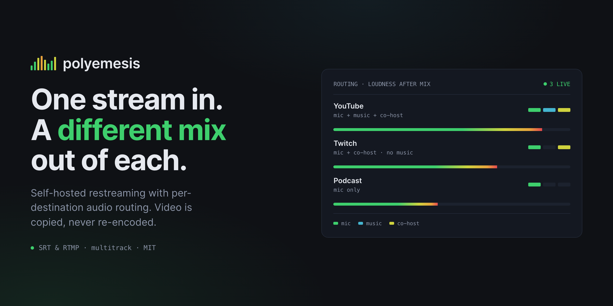
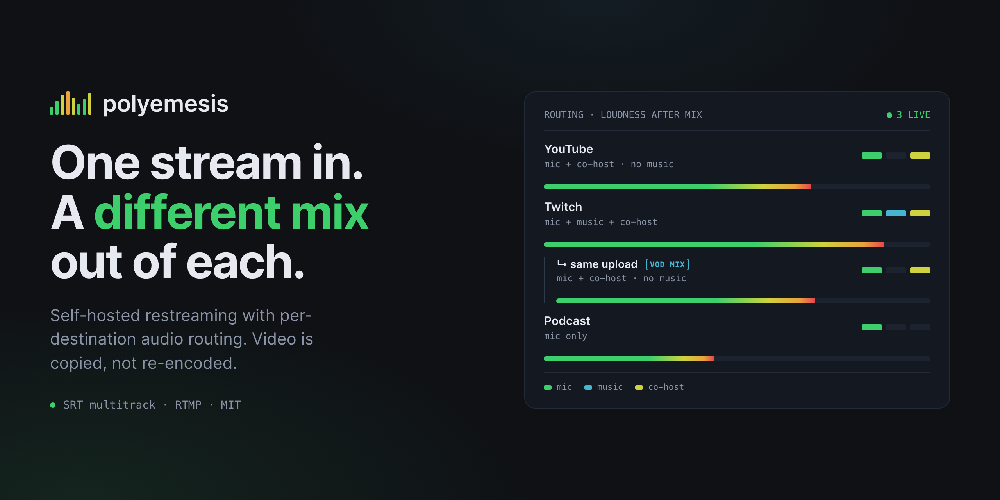
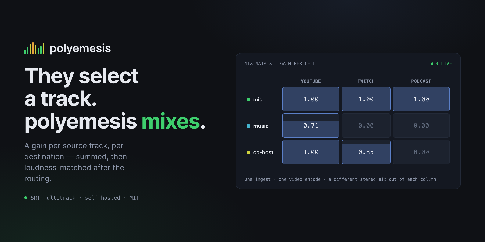
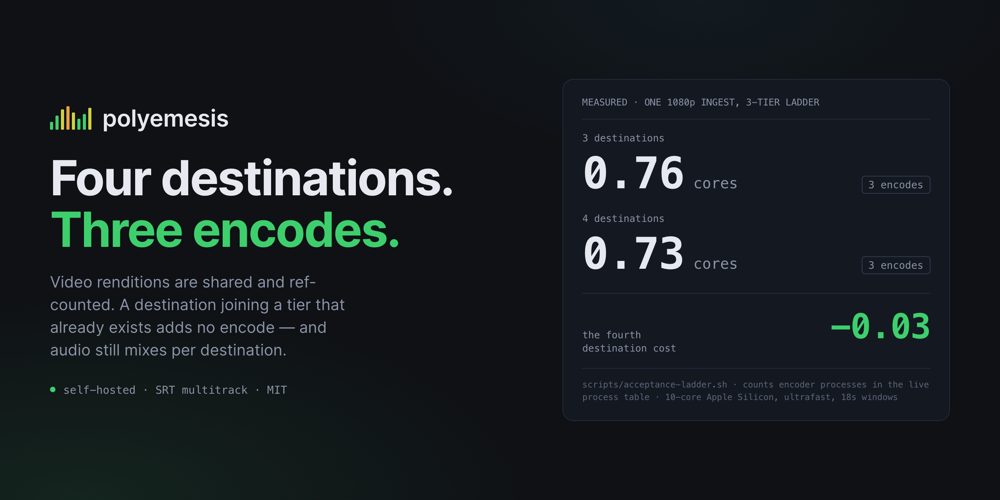
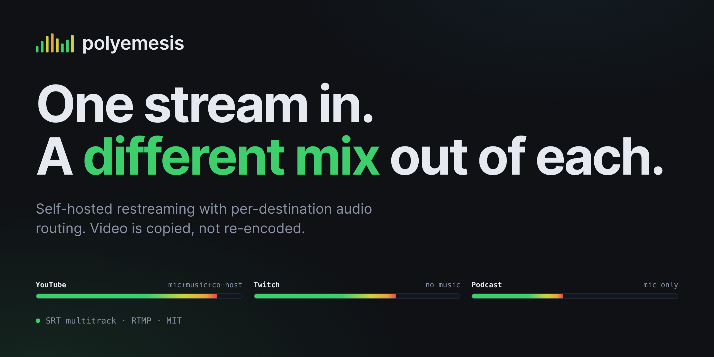

# Social preview — candidate iterations

Four candidates plus the incumbent, so the comparison has a baseline. Nothing
here replaces `card.html` / `social-preview.png`; the incumbent stays until a
choice is made.

Every candidate obeys the constraints in [README.md](README.md): **2560×1280**
(1280×640 at 2×), all content inside the 56px margin, palette and wordmark
copied verbatim from `ui/src/index.css`. The render harness asserts the margin
rather than trusting the eye — it walks every element's bounding box and fails
any that crosses 56px.

## Render them

Same recipe as the incumbent, over each `card-*.html`. The harness was verified
against the baseline first: rendering the *incumbent* `card.html` through it
reproduced the committed `social-preview.png` **byte for byte** (sha256
`c405f10d…1fd5`), so the candidates below differ from the baseline because of
their markup and nothing else.

Each variant also has a `-400.png` — the same image at 400px wide, which is
roughly how a Slack or Discord unfurl actually appears. **Judge these first.**
A headline that survives full size and dies at thumbnail is the failure mode
this set exists to catch, and it caught several.

---

## Baseline — the incumbent

`card.html` → `social-preview.png`. Headline *"One stream in. A different mix
out of each."*, a three-destination routing panel, footer `SRT & RTMP ·
multitrack · MIT`.

**What it optimises for:** the product's argument as a picture — three
destinations taking three different subsets of the same three tracks, each with
its own post-routing level.

**Weaknesses, and why this set exists:**

- **The panel is illegible at 400px.** Destination names are barely resolvable,
  track chips are undifferentiated dashes, the legend and footer are texture.
  The one thing that survives is the three meter bars being three different
  lengths — which is, to be fair, the argument. But it is doing far less work
  at thumbnail size than it appears to at full size.
- **"Video is copied, never re-encoded" now overclaims.** `docs/ENCODING.md:3`
  is the canonical statement: *"video is copied by default and only encoded when
  you ask for a rendition."* Renditions exist precisely so you can re-encode when
  a platform demands it, so "never" risks reading as "cannot". Every candidate
  below uses "copied, not re-encoded", which is `README.md:44`'s own wording.
- **`SRT & RTMP · multitrack` is ambiguous.** `README.md:98` is explicit that
  *"RTMP multitrack is not the operated path… SRT is what is operated."* Read as
  three independent tags the footer is fine; read as "multitrack over both" it
  contradicts the README. Candidates use `SRT multitrack · RTMP` instead.
- **It predates the second (VOD) audio mix**, and the three-line headline
  exceeds DESIGN-SYSTEM.md's *"headline at two lines maximum"*.

---

## A — freshen the incumbent

Same layout and same strengths. The routing panel gains a fourth row that is not
a fourth destination: it is a **second mix on the same upload**, indented behind
a rule and tagged `VOD MIX`, which is Twitch Enhanced Broadcasting's VOD audio
track. `3 LIVE` stays true — four mixes over three connections.

Also corrected here: YouTube now takes the clean feed (`README.md:35`'s own
worked example), so that **the same track selection produces the same bar
length wherever it appears**. The incumbent had two rows with identical chips
and different meters, which quietly makes the meter decoration rather than a
measurement.

**Optimising for:** continuity. The lowest-risk change, and the new capability is
shown rather than described.

**Weaknesses:**

- **The new capability does not survive the thumbnail.** At 400px the indent
  rule and the `VOD MIX` tag both vanish and the row reads as an ordinary fourth
  destination. The one reason to make this change is invisible at the size the
  card is most often seen.
- **It asserts an experimental feature.** `docs/AUDIO-ROUTING.md:43` marks the
  second mix **EXPERIMENTAL**: *"on Twitch, no broadcast has ever been published
  through a key Enhanced Broadcasting minted… no second audio track has been seen
  arriving at Twitch."* A social card cannot carry that caveat, and
  `docs/COPY-CONSTRAINTS.md` is emphatic about not implying more than was
  measured. **Do not ship A until the feature is observed end to end.**
- Inherits the incumbent's three-line headline and its dense panel.

---

## B — lead with the mix matrix

Headline is `docs/COMPARISON.md:46` verbatim: **"They select a track. polyemesis
mixes."** The panel becomes a gain matrix — ingest tracks as rows, destinations
as columns, a gain in every cell.

The cell is designed to work at two sizes at once: a precise mono figure at full
size, and a **fill whose height is the gain** at thumbnail size, where 17px mono
is gone but the filled/empty pattern still reads. Cells fill with `--primary`,
not a signal colour, because a gain is a setting and not a state — this is what
`ui/src/components/signature/MixMatrix.tsx` does (`bg-primary/30`) and what
`index.css` requires.

**Optimising for:** the differentiator, at thumbnail size. A grid reads instantly
where a paragraph does not, and per-cell gain across tracks × destinations is
the thing `COMPARISON.md` argues no competitor does.

**Weaknesses:**

- **"They" has no antecedent on a social card.** In COMPARISON.md the reader has
  just been shown obs-multi-rtmp's `struct AudioTrackConfig`; on an unfurled link
  they have not. It reads as intriguing rather than confusing, but it is a
  gamble.
- Three lines again, and the break after "They select" is awkward.
- The `mic` row is 1.00 across the board, so the top third of the grid carries
  no contrast. True to life — everyone gets the mic — but visually inert.
- Simplifies the real matrix, which is channel-level (`L`/`R` per track), not
  track-level. Honest as an illustration of the operation; not a screenshot.

---

## C — lead with the measured cost

**"Four destinations. Three encodes."** with the ladder measurement beside it:
0.76 cores for three destinations, 0.73 for four, and the fourth destination's
cost as **−0.03**.

Numbers are monospaced, tabular and right-aligned per DESIGN-SYSTEM.md rule 5,
and they are the largest thing on the panel by a wide margin — a figure that
dies at 400px is a figure nobody reads.

**Optimising for:** concreteness. Measured numbers are rare on social cards and
this project can back them.

**Weaknesses:**

- **The numbers are not in a tracked file.** They live in PR #369's `## Measured
  CPU` table and in commit messages, in three mutually inconsistent versions
  (`0.28/0.25/0.21`, `0.28/0.26/0.21`, `0.29/0.26/0.21`). The figures used here
  are the PR body's two-run totals, which are the only ones that state hardware,
  preset and window. **If C ships, those totals should be promoted into
  `docs/ENCODING.md` first**, so the card cites something a reader can check.
- **They are one machine's numbers** — 10-core Apple Silicon, `ultrafast`, 18s
  windows. The card says so in fine print that is illegible at 400px, which is
  the honest place for it but not a satisfying one.
- **−0.03 invites a "that's noise" reaction**, and it partly is: the measured
  range was −0.03 to −0.05 against a 0.21 cheapest-tier yardstick. The claim it
  actually supports is "no fourth encode", which the headline already makes
  better than the number does.
- It leads with cost, not with what the product *is* — a reader who does not
  already know what polyemesis does learns less here than from any other variant.

---

## D — typographic minimum

No panel. Wordmark, the claim at 92px over two lines, one line of proof, and a
single row of three meters at three different post-routing levels.

**Optimising for:** the size the card is actually seen at. This is the only
variant whose entire content is legible at 400px.

**Weaknesses:**

- **It says nothing the incumbent does not.** It says it far more clearly, but a
  reader learns the same facts.
- It drops the routing panel, and with it the per-destination track selection —
  the meters show that levels differ but not *why*, so the argument is asserted
  and only half-shown. DESIGN-SYSTEM.md's *"the hero should be the meter"* is
  satisfied; *"one source, three destinations, each taking a different set"* is
  not.
- At full size the frame is comparatively empty, which reads as confident or as
  underbuilt depending on taste.

---

## Recommendation

**B**, with **D** as the safe alternative.

B is the only candidate whose hero image is the actual differentiator *and*
survives 400px: the filled/empty pattern of the grid carries the claim at the
size the card is seen, and the gain figures reward anyone who opens it. Every
claim on it is shipped and measured — it makes no reference to the experimental
second mix and cites no number that is not in a tracked file.

D wins the pure legibility test and is the right pick if the priority is that a
first-time reader understands what polyemesis *is* in one glance.

A should not ship in its current form: it puts an EXPERIMENTAL, never-observed-
end-to-end capability on the repository's most public image, and the thumbnail
does not even show it. C is worth revisiting once its figures live in
`docs/ENCODING.md` rather than in a PR comment.
